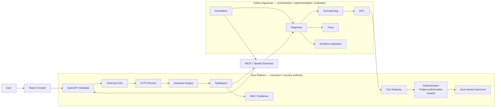

# Agentic APIOps

Production-style API testing and diagnosis platform with Java execution authority, Python Agent workflows, a guarded Tool Gateway, tracing/evaluation, and a React console.

[](https://github.com/guyun16/agentic-apiops-public/actions/workflows/java-ci.yml)


## Why this project is different

- Java is the execution and security authority: `OpenAPI → TestCase DSL → Runner → Assertion → TestReport`.
- Python AgentLab handles TestCase generation, diagnosis, tool-use orchestration, tracing, and runtime evaluation.
- Agents cannot bypass Java-owned resources; tool access goes through the guarded Java Tool Gateway.
- The Java ↔ Python boundary is verified with cross-process E2E tests and GitHub Actions CI.

## Quick start

Run each verification block from the repository root.

### Verify the repository

```bash
# Java Platform
cd java-apiops-platform
./mvnw clean verify
```

```bash
# Python AgentLab
cd python-apiops-agentlab
uv run ruff check .
uv run pytest
```

```bash
# React Console
cd apiops-console
npm ci
npm run lint
npm run test:context
npm run build
```

On Windows, use `./mvnw.cmd clean verify` for the Java command.

### Local development

```bash
# Python API
cd python-apiops-agentlab
uv run uvicorn app.main:app --reload
```

```bash
# Console
cd apiops-console
npm run dev
```

The Console and AgentLab connect to their configured Java/Python services. `docker-compose.dev.yml` provides local MySQL, Redis, and RabbitMQ infrastructure; it is not a one-command application deployment.

## Architecture



Java owns formal execution, security, reports, and Java-managed resources. Python owns Agent orchestration, tool intent, tracing, and evaluation. The tool path is `Python Agent → Java Tool Gateway → Auth / Guard → Java-owned resource`.

## Core flow

```text
OpenAPI → Metadata → TestCase DSL → Async Runner → Assertion → TestReport
→ Diagnosis → Evidence / Tool → DiagnosisReport → Trace / Evaluation
```

OpenAPI facts become normalized metadata and an executable DSL. Java validates and runs the test, then publishes the authoritative report. AgentLab consumes that report and controlled evidence to produce structured diagnosis and evaluation outputs.

## Authority boundary

| Fact / Responsibility | Authority |
| --- | --- |
| OpenAPI metadata | Java Platform |
| DSL validation | Java Platform |
| HTTP execution | Java Runner |
| Assertions | Java Platform |
| TestReport | Java Platform |
| Tool authorization | Java Tool Gateway |
| Agent workflow | Python AgentLab |
| Diagnosis reasoning | Python AgentLab |
| Agent trace | Python AgentLab |
| Runtime evaluation | Python AgentLab |

`LLM output` is a candidate or inference. `Java TestReport` is execution truth. Python Diagnosis is not execution truth; Human Approval is not Java Authorization; and Python `ALLOW` is not Java `ALLOW`.

## Implemented & Verified

### Java Platform

- OpenAPI metadata and project-scoped API access
- TestCase DSL validation
- HTTP Runner and asynchronous batch execution
- Assertion Engine and authoritative TestReport
- JWT/project authorization
- RAG retrieval and Context Pack construction
- Structured Agent generation and diagnosis integration
- Tool Gateway, guards, sanitization, and audit

### Python AgentLab

- TestCase Generation workflow
- Diagnosis workflow with structured outputs
- Context engineering and Java evidence consumption
- Tool planning and guarded tool-use workflow
- HITL approval flow
- Trace recording and redaction
- Runtime evaluator, metrics, judge, and reporting

### Console

- Overview
- API Studio
- Runs
- Diagnosis Studio and Diagnosis execution
- Traces
- Evaluation
- Settings

## Implementation Evidence

| Capability | Implementation | Verification |
| --- | --- | --- |
| OpenAPI metadata | [OpenAPI metadata controller](java-apiops-platform/apiops-openapi/src/main/java/com/apiops/openapi/controller/OpenApiMetadataQueryController.java) | [Controller test](java-apiops-platform/apiops-openapi/src/test/java/com/apiops/openapi/controller/OpenApiMetadataQueryControllerTest.java) |
| TestCase DSL validation | [DSL validator](java-apiops-platform/apiops-runner/src/main/java/com/apiops/runner/validation/TestCaseDslValidator.java) | [Validation tests](java-apiops-platform/apiops-runner/src/test/java/com/apiops/runner/validation/TestCaseDslValidationTest.java) |
| HTTP execution | [Run execution service](java-apiops-platform/apiops-runner/src/main/java/com/apiops/runner/application/RunExecutionService.java) | [Runner service tests](java-apiops-platform/apiops-runner/src/test/java/com/apiops/runner/application/RunExecutionServiceTest.java) |
| Assertions | [Assertion Engine](java-apiops-platform/apiops-runner/src/main/java/com/apiops/runner/assertion/AssertionEngine.java) | [Assertion tests](java-apiops-platform/apiops-runner/src/test/java/com/apiops/runner/assertion/AssertionEngineTest.java) |
| Async test batches | [Batch controller](java-apiops-platform/apiops-web/src/main/java/com/apiops/web/runner/controller/AsyncBatchController.java) | [Batch controller tests](java-apiops-platform/apiops-web/src/test/java/com/apiops/web/runner/controller/AsyncBatchControllerTest.java) |
| TestReport | [Report controller](java-apiops-platform/apiops-report/src/main/java/com/apiops/report/controller/TestReportController.java) | [Report controller tests](java-apiops-platform/apiops-report/src/test/java/com/apiops/report/TestReportControllerTest.java) |
| Tool Gateway | [Tool Gateway](java-apiops-platform/apiops-tool-gateway/src/main/java/com/apiops/tool/gateway/ToolGateway.java) | [Gateway tests](java-apiops-platform/apiops-tool-gateway/src/test/java/com/apiops/tool/gateway/ToolGatewayTest.java) |
| RAG / evidence | [Context Pack builder](java-apiops-platform/apiops-rag/src/main/java/com/apiops/rag/context/ContextPackBuilder.java) | [Context Pack tests](java-apiops-platform/apiops-rag/src/test/java/com/apiops/rag/context/ContextPackBuilderTest.java) |
| Python generation | [Generation workflow](python-apiops-agentlab/app/workflows/testcase_generation_graph.py) | [Generation workflow tests](python-apiops-agentlab/tests/workflows/test_testcase_generation_graph.py) |
| Python diagnosis | [Diagnosis workflow](python-apiops-agentlab/app/workflows/diagnosis_workflow.py) | [Diagnosis workflow tests](python-apiops-agentlab/tests/workflows/test_diagnosis_workflow.py) |
| Tracing | [Trace recorder](python-apiops-agentlab/app/tracing/recorder.py) | [Trace recorder tests](python-apiops-agentlab/tests/tracing/test_recorder.py) |
| Runtime evaluation | [Evaluator](python-apiops-agentlab/app/evaluator/evaluator.py) | [Evaluator tests](python-apiops-agentlab/tests/evaluator/test_evaluator.py) |
| Java ↔ Python integration | [Java API client](python-apiops-agentlab/app/clients/java_apiops.py) | [Cross-process E2E test](java-apiops-platform/apiops-web/src/test/java/com/apiops/web/tool/Stage20FinalAcceptanceCrossProcessE2ETest.java) |
| Console navigation | [Console shell](apiops-console/src/components/layout/AppShell.tsx) | [Context-trail verification](apiops-console/scripts/verify-context-trail.ts) |

## Agent Safety Boundary

```text
Agent ToolIntent
→ Python Guard / optional HITL
→ Java Tool Gateway
→ Authentication
→ Project Authorization
→ ToolAuth
→ Parameter / Resource Guard
→ Execution
→ Sanitization
→ Audit
```

Python AgentLab does not directly access Java-owned MySQL, Redis, RabbitMQ, internal services, raw logs, or vector resources. Requests cross the guarded Java boundary and return structured, sanitized results with audit context.

## REST integration

The public integration surface is project-scoped:

| Capability | Method | Path |
| --- | --- | --- |
| OpenAPI metadata | `GET` | `/api/v1/projects/{projectId}/openapi/apis/{apiId}` |
| Submit test batch | `POST` | `/api/v1/projects/{projectId}/test-batches` |
| Read test report | `GET` | `/api/v1/projects/{projectId}/test-runs/{runId}/report` |
| Call a guarded tool | `POST` | `/api/v1/projects/{projectId}/tool-calls` |

TestCase DSL validation is enforced inside Java Agent and Runner service boundaries; there is no standalone validation REST endpoint in the current public implementation.

## Verification

These figures come from the current public release verification:

- **Java:** 11-module Maven reactor, `BUILD SUCCESS`
- **Python:** Ruff `PASS`; `740 passed`, 4 warnings
- **Console:** lint `PASS`, context test `PASS`, build `PASS`
- **GitHub Actions:** Java CI `PASS`

## Public scope

This public portfolio intentionally excludes private/internal documentation, Benchmark / Stage21 materials, runtime artifacts, and credentials. It includes executable production source, ordinary tests, shared schemas, and public-safe configuration.

Benchmark materials are not included in this public release.

## Repository structure

```text
agentic-apiops-public
├── .github
├── examples
├── scripts
├── shared-schemas
├── java-apiops-platform
├── python-apiops-agentlab
├── apiops-console
└── README.md
```

Java is responsible for platformization, execution, security, audit, and formal business closure. Python is responsible for Agent workflow, tool orchestration, tracing, and runtime evaluation. The projects meet through shared schemas, REST contracts, and the Java Tool Gateway.

Configuration templates are provided as `.env.example` files; real credentials are never committed.
